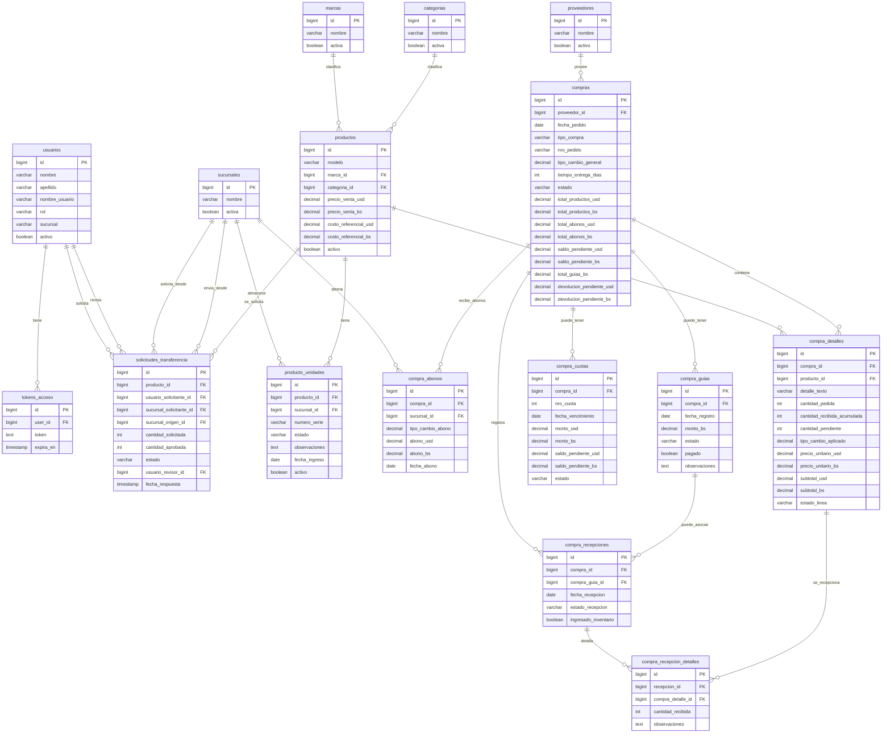

# Diagrama De Base De Datos

Este diagrama resume la base de datos funcional del proyecto hasta ahora.

- Incluye tablas de negocio principales
- Omite tablas tecnicas de Laravel como `cache`, `jobs`, `failed_jobs`
- Usa nombres reales de tablas y relaciones implementadas

## Lectura Rapida

- `productos` es el catalogo base
- `producto_unidades` guarda cada unidad fisica real por sucursal
- `compras` concentra la cabecera del pedido o compra
- `compra_detalles` guarda cada linea del pedido
- `compra_abonos` registra pagos directos por sucursal
- `compra_cuotas` queda preparada para escenarios de credito
- `compra_guias` controla el transporte o envio
- `compra_recepciones` y `compra_recepcion_detalles` controlan llegadas parciales o totales
- `solicitudes_transferencia` registra movimientos solicitados entre sucursales

## Sugerencia Para Entregar Como Imagen

Puedes abrir este archivo en:

- GitHub
- VS Code con vista previa Markdown
- Mermaid Live Editor

Y desde ahi exportarlo como imagen si te piden una "foto" del modelo.
